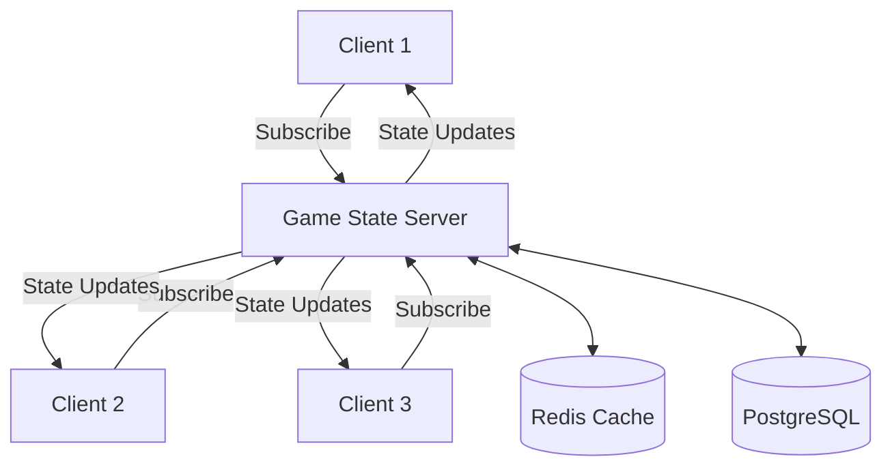
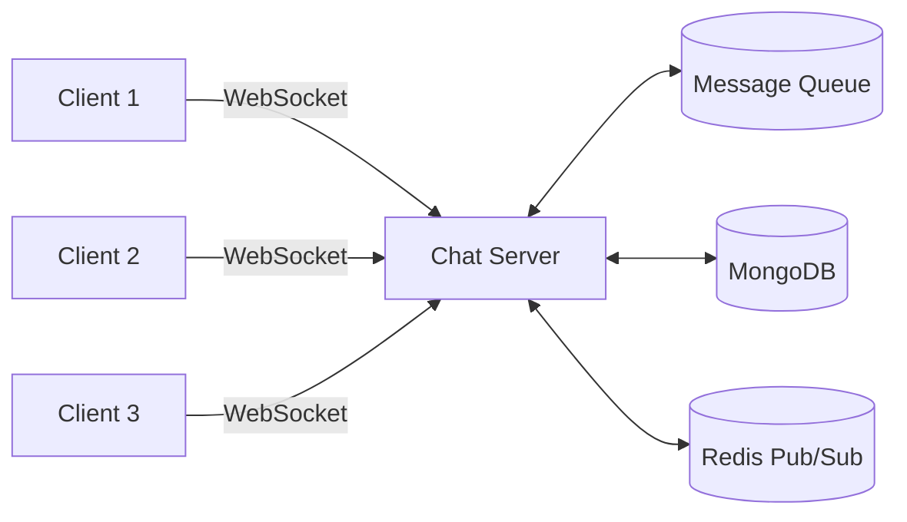

# MCP Server Implementation Guide

This document provides detailed implementation guidelines for the MCP (Microservice Communication Protocol) servers used in the Euchre Multiplayer game.

## Table of Contents
1. [Game State Management Server](#game-state-management-server)
   - [Architecture](#game-state-architecture)
   - [API Endpoints](#game-state-api)
   - [Data Models](#game-state-models)
   - [Implementation Notes](#game-state-notes)

2. [Chat & Communication Server](#chat-communication-server)
   - [Architecture](#chat-architecture)
   - [API Endpoints](#chat-api)
   - [Data Models](#chat-models)
   - [Implementation Notes](#chat-notes)

## Game State Management Server

### Architecture

The Game State Management Server is responsible for maintaining the authoritative game state and handling all game logic. It follows a pub/sub pattern where clients subscribe to game state updates.



### API Endpoints

#### `POST /api/game/create`
- **Description**: Create a new game instance
- **Request Body**: 
  ```json
  {
    "gameType": "standard",
    "maxPlayers": 4,
    "options": {
      "scoreToWin": 10,
      "allowScrewTheDealer": true
    }
  }
  ```
- **Response**: 
  ```json
  {
    "gameId": "uuid",
    "joinCode": "ABC123"
  }
  ```

#### `POST /api/game/:gameId/join`
- **Description**: Join an existing game
- **Request Body**: 
  ```json
  {
    "playerId": "player123",
    "playerName": "Alice"
  }
  ```
- **Response**: Current game state

#### `POST /api/game/:gameId/action`
- **Description**: Submit a game action (play card, bid, etc.)
- **Request Body**: 
  ```json
  {
    "playerId": "player123",
    "actionType": "PLAY_CARD",
    "card": "AH",
    "timestamp": 1620000000
  }
  ```
- **Response**: Updated game state

### Data Models

#### Game
```typescript
interface Game {
  id: string;
  status: 'waiting' | 'bidding' | 'playing' | 'finished';
  players: Player[];
  currentTurn: string; // playerId
  deck: Card[];
  trick: {
    cards: { [playerId: string]: Card };
    leader: string; // playerId
    trumpSuit?: Suit;
  };
  scores: {
    team1: number;
    team2: number;
  };
  history: GameAction[];
  settings: GameSettings;
}
```

### Implementation Notes

1. **State Management**:
   - Use Redis for fast in-memory state storage
   - Implement optimistic locking for concurrent updates
   - Maintain full action history for replayability

2. **Validation**:
   - Validate all game actions against current state
   - Implement anti-cheat measures
   - Rate limit actions to prevent flooding

3. **Scaling**:
   - Shard games across multiple instances
   - Use consistent hashing for game distribution
   - Implement health checks and auto-recovery

## Chat & Communication Server

### Architecture

The Chat & Communication Server handles all real-time communication between players, including text chat, voice chat, and game notifications.



### API Endpoints

#### `POST /api/chat/message`
- **Description**: Send a chat message
- **Request Body**:
  ```json
  {
    "senderId": "player123",
    "gameId": "game456",
    "message": "Good game!",
    "type": "TEXT",
    "timestamp": 1620000000
  }
  ```
- **Response**: Message receipt

#### `POST /api/chat/notification`
- **Description**: Send a game notification
- **Request Body**:
  ```json
  {
    "type": "PLAYER_LEFT",
    "gameId": "game456",
    "playerId": "player123",
    "message": "Alice has left the game"
  }
  ```

#### `GET /api/chat/history/:gameId`
- **Description**: Get chat history for a game
- **Response**:
  ```json
  [
    {
      "id": "msg123",
      "senderId": "player123",
      "senderName": "Alice",
      "message": "Good game!",
      "type": "TEXT",
      "timestamp": 1620000000
    }
  ]
  ```

### Data Models

#### ChatMessage
```typescript
interface ChatMessage {
  id: string;
  gameId: string;
  senderId: string;
  senderName: string;
  message: string;
  type: 'TEXT' | 'EMOTE' | 'SYSTEM';
  timestamp: number;
  metadata?: {
    emoteId?: string;
    voiceClipUrl?: string;
    language?: string;
  };
}
```

### Implementation Notes

1. **Real-time Communication**:
   - Use WebSockets for bidirectional communication
   - Implement message queuing for offline clients *NO PLANS TO IMPLEMENT THIS*
   - Support message persistence for game history

2. **Voice Chat**:  *NO PLANS TO IMPLEMENT THIS*
   - Integrate WebRTC for peer-to-peer voice *NO PLANS TO IMPLEMENT THIS*
   - Use SFU (Selective Forwarding Unit) for group calls *NO PLANS TO IMPLEMENT THIS*
   - Implement echo cancellation and noise suppression *NO PLANS TO IMPLEMENT THIS*

3. **Moderation**:
   - Implement profanity filtering *NO PLANS TO IMPLEMENT THIS*
   - Support for muting/blocking players
   - Log all communications for moderation *NO PLANS TO IMPLEMENT THIS*

4. **Performance**:
   - Use Redis Pub/Sub for message broadcasting
   - Implement message batching
   - Use compression for voice data *NO PLANS TO IMPLEMENT THIS*

## Deployment

Both servers should be deployed as containerized microservices with the following considerations:

1. **Containerization**:
   ```dockerfile
   FROM node:18
   WORKDIR /app
   COPY package*.json ./
   RUN npm ci --only=production
   COPY . .
   CMD ["node", "server.js"]
   ```

2. **Orchestration**:
   - Use Kubernetes for container orchestration
   - Implement horizontal pod autoscaling
   - Use service meshes for inter-service communication

3. **Monitoring**:
   - Implement Prometheus for metrics collection
   - Use Grafana for visualization
   - Set up alerts for error rates and latency

## Security Considerations

1. **Authentication**:
   - Use JWT for stateless authentication
   - Implement rate limiting
   - Validate all input data

2. **Data Protection**:
   - Encrypt sensitive data at rest
   - Use TLS for all communications
   - Implement proper CORS policies

3. **Compliance**:
   - Follow GDPR for data protection
   - Implement age verification if required
   - Maintain audit logs of all actions

## Scaling Strategy

1. **Horizontal Scaling**:
   - Stateless design for easy scaling
   - Use connection pooling for database connections
   - Implement sticky sessions if needed

2. **Caching**:
   - Use Redis for frequently accessed data
   - Implement cache invalidation strategies
   - Use CDN for static assets

3. **Load Testing**:
   - Simulate peak loads
   - Identify and optimize bottlenecks
   - Monitor resource usage under load
