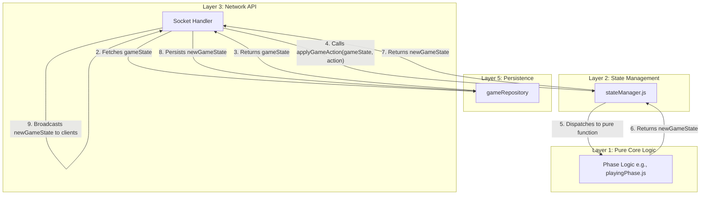
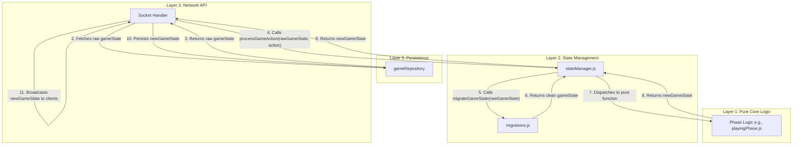

# Layer 2 Development Blueprint: State Management

## 1. Introduction & Core Principles

This document outlines the complete development plan for creating and integrating **Layer 2: State Management**. Currently, state management is a conceptual process orchestrated within Layer 3 network handlers. This blueprint formalizes Layer 2 into a dedicated, explicit layer to enhance stability, reduce complexity in Layer 3, and strictly enforce the project's architectural mandates.

### Core Principles

*   **Single Source of Truth:** Layer 2 will be the sole authority for the `gameState` object. It will manage the lifecycle of the state for each active game.
*   **Immutability:** All state transitions within Layer 2 will be strictly immutable. Functions will receive the current state and an action, and will always return a *new, updated* state object, never mutating the original.
*   **Orchestration, Not Logic:** Layer 2's responsibility is to orchestrate state changes. It will act as a "controller" that receives actions, calls the appropriate pure game logic functions from **Layer 1**, and returns the resulting new state. It will contain no game rule logic itself.

## 2. Proposed Architecture & File Structure

To implement this, we will create a new directory: `src/game/state/`. This directory will contain all Layer 2 modules.

### Architectural Flow

The new data flow will be clearer and more aligned with the layered architecture principles.



### File Structure

```
src/
└── game/
    ├── logic/      # Layer 1
    ├── phases/     # Layer 1
    └── state/      # Layer 2 (NEW)
        ├── gameState.js
        ├── stateManager.js
        └── state.unit.test.js
```

## 3. File Breakdown & Implementation Details

### 3.1. `src/game/state/gameState.js`

This module will define the canonical structure of the `gameState` object and provide factory functions for creating initial states.

#### `GameState` JSDoc Definition

A comprehensive `@typedef` will be created to serve as the single source of truth for the shape of the game state.

```javascript
/**
 * @typedef {object} Card
 * @property {string} id - The unique identifier for the card (e.g., 'AS', '9H').
 * @property {string} suit - The suit of the card (e.g., CARD_SUITS.SPADES).
 * @property {string} value - The face value of the card (e.g., 'A', 'K', '9').
 * @property {number} rank - The base rank of the card (9-14).
 */

/**
 * Represents a single player at the table.
 * @typedef {object} Player
 * @property {string} userId - A persistent, unique identifier for the user account.
 * @property {string | null} socketId - The current, ephemeral socket ID of the player. Null if disconnected.
 * @property {string} playerRole - The player's fixed role at the table (e.g., PLAYER_ROLES.SOUTH), which determines their seat and partner.
 * @property {string} playerName - The user-provided display name for the game.
 * @property {string} team - The team the player belongs to (e.g., TEAMS.NS), derived from their role.
 * @property {Card[]} hand - The array of Card objects currently in the player's hand.
 * @property {boolean} isConnected - The live connection status of the player. True if they have an active socket.
 * @property {boolean} isHost - True if this player initiated the creation of the game.
 */

/**
 * Represents the state of one of the two teams in the game.
 * @typedef {object} TeamState
 * @property {number} score - The total score for the team across all hands played.
 * @property {number} tricksTaken - The number of tricks the team has won in the *current* hand. Resets to 0 each hand.
 */

/**
 * Represents the entire state of a single Euchre game. This object is the single
 * source of truth for a game instance and is persisted to the database.
 * @typedef {object} GameState
 * @property {number} schemaVersion - The version of this state object's schema, used for migrations.
 * @property {string} gameId - The unique identifier for the game session.
 * @property {string} gamePhase - The current phase of the game, dictates available actions (e.g., GAME_PHASES.LOBBY, GAME_PHASES.PLAYING).
 * @property {object<string, Player>} players - A map of player roles (e.g., 'PLAYER_SOUTH') to their respective Player objects.
 * @property {string} dealer - The role of the player who is the dealer for the current hand. Rotates clockwise each hand.
 * @property {string} currentPlayer - The role of the player whose turn it is to act.
 * @property {Card[]} deck - The array of cards in the deck. After dealing, this typically contains no cards.
 * @property {Card[]} kitty - The four cards remaining after dealing 5 to each player. The top card becomes the turnCard.
 * @property {Card | null} turnCard - The face-up card from the kitty that is used for the first round of bidding. Becomes null after bidding.
 * @property {string | null} trumpSuit - The suit chosen as trump for the current hand. Null until bidding is complete.
 * @property {string | null} makerTeam - The team that chose the trump suit (e.g., TEAMS.NS). Null until bidding is complete.
 * @property {boolean} goingAlone - True if the maker has chosen to play the hand without their partner.
 * @property {string | null} playerGoingAlone - The role of the player who is going alone.
 * @property {string | null} partnerSittingOut - The role of the partner who is inactive for the current hand.
 * @property {{ playerRole: string, card: Card }[]} currentTrick - An array of objects representing the cards played in the current trick.
 * @property {object[]} bids - A log of all bidding actions taken during the current hand's bidding phase.
 * @property {object<string, TeamState>} teams - Contains the score and tricks taken for both TEAM_NS and TEAM_EW.
 * @property {object} settings - The game settings, such as the score required to win.
 * @property {object[]} history - A chronological log of all significant game events, used for review and debugging.
 * @property {number} handNum - The sequential number of the current hand being played.
 * @property {Date} createdAt - The ISO timestamp when the game was first created.
 * @property {Date} updatedAt - The ISO timestamp of the last time the game state was modified. Used for TTL indexing.
 */
```

#### Factory Functions

```javascript
// src/game/state/gameState.js

/**
 * Creates a new, default player object.
 * @param {string} role - The player's role (e.g., PLAYER_ROLES.SOUTH).
 * @param {string} userId - The user's unique ID.
 * @param {string} playerName - The user's display name.
 * @param {boolean} [isHost=false] - Whether this player is the host.
 * @returns {Player} A new player object.
 */
export function createPlayer(role, userId, playerName, isHost = false) {
  // ... implementation ...
}

/**
 * Creates the initial state for a brand new game.
 * @param {string} gameId - The unique ID for the new game.
 * @param {object} hostDetails - Details of the host player { userId, playerName }.
 * @returns {GameState} A new game state object, initialized for the LOBBY phase.
 */
export function createInitialGameState(gameId, hostDetails) {
  // ... implementation ...
}
```

### 3.2. `src/game/state/stateManager.js`

This module is the core of Layer 2. It will house the central dispatcher function that applies actions to the game state by invoking Layer 1 logic.

```javascript
// src/game/state/stateManager.js

import * as biddingPhase from '../phases/biddingPhase.js';
import * as playingPhase from '../phases/playingPhase.js';
// ... import other phase logic files

/**
 * The central state machine for the game. It takes the current state and an
 * action, and returns the new state by dispatching to the appropriate
 * pure Layer 1 function.
 *
 * @param {GameState} currentGameState - The current, immutable game state.
 * @param {{type: string, payload: object}} action - The action to apply.
 * @returns {GameState} The new, updated game state.
 * @throws {Error} If the action type is unknown or a phase logic error occurs.
 */
export function applyGameAction(currentGameState, action) {
  const { type, payload } = action;

  switch (type) {
    case 'ORDER_UP_DECISION':
      return biddingPhase.handleOrderUpDecision(currentGameState, payload.playerRole, payload.decision);

    case 'DEALER_DISCARD':
      return biddingPhase.handleDealerDiscard(currentGameState, payload.playerRole, payload.card);

    case 'PLAY_CARD':
      return playingPhase.handlePlayCard(currentGameState, payload.playerRole, payload.card);

    // ... other cases for every possible game action ...

    default:
      // Optional: log a warning for unhandled actions
      // logger.warn(`Unknown action type: ${type}`);
      return currentGameState; // Return original state if action is unknown
  }
}
```

## 4. Integration with Other Layers

### Layer 3: Network API (`src/socket/handlers/`)

The socket handlers will be significantly simplified. Instead of containing orchestration logic, they will now be responsible for:
1.  Receiving a socket event.
2.  Fetching the current `gameState` from `gameRepository` (Layer 5).
3.  Creating a structured `action` object.
4.  Calling `applyGameAction` from `stateManager.js` (Layer 2).
5.  Persisting the returned `newGameState` to `gameRepository` (Layer 5).
6.  Broadcasting the `newGameState` to clients.

**Example Refactor (`playingHandlers.js`):**

```javascript
// BEFORE: Logic is inside the handler
socket.on('PLAY_CARD', async (data) => {
  const gameState = await gameRepo.getGame(data.gameId);
  // validation logic here...
  const newGameState = handlePlayCard(gameState, data.playerRole, data.card); // Direct call to Layer 1
  await gameRepo.updateGame(newGameState);
  io.to(data.gameId).emit('STATE_UPDATE', newGameState);
});

// AFTER: Handler dispatches to Layer 2
import { applyGameAction } from '../../game/state/stateManager.js';

socket.on('PLAY_CARD', async (data) => {
  try {
    const gameState = await gameRepo.getGame(data.gameId);
    const action = {
      type: 'PLAY_CARD',
      payload: { playerRole: data.playerRole, card: data.card }
    };
    const newGameState = applyGameAction(gameState, action); // Call Layer 2
    await gameRepo.updateGame(newGameState);
    io.to(data.gameId).emit('STATE_UPDATE', newGameState);
  } catch (error) {
    // Handle errors thrown by Layer 1/2
    socket.emit('ACTION_ERROR', { message: error.message });
  }
});
```

## 5. Testing Strategy

*   **`gameState.js`:** Unit tests will be written for the `createPlayer` and `createInitialGameState` factory functions to ensure they produce correctly structured objects.
*   **`stateManager.js`:** Unit tests for `applyGameAction` will be crucial.
    *   Tests will provide a specific `currentGameState` and an `action`.
    *   The corresponding Layer 1 phase function (e.g., `biddingPhase.handleOrderUpDecision`) will be mocked using `node:test`.
    *   Assertions will verify that the correct Layer 1 function was called with the correct parameters.
    *   Assertions will also verify that the `newGameState` returned by the mock is passed through correctly.

## 7. Future-Proofing: State Schema & Migration

As the application evolves, the structure of the `GameState` object will inevitably change. To prevent breaking changes and ensure that games persisted with an old schema can still be loaded, we will implement a simple versioning and migration strategy.

### 7.1. Schema Versioning

A `schemaVersion` property will be added to the `GameState` object.

**JSDoc Update in `gameState.js`:**

```javascript
/**
 * Represents the entire state of a single Euchre game.
 * @typedef {object} GameState
 * @property {number} schemaVersion - The version of the game state schema.
 * @property {string} gameId - The unique identifier for the game.
 // ... rest of the properties
 */
```

**Implementation in `createInitialGameState`:**

The `createInitialGameState` factory in `gameState.js` will be updated to include the current schema version.

```javascript
// src/game/state/gameState.js
const CURRENT_SCHEMA_VERSION = 1;

export function createInitialGameState(gameId, hostDetails) {
  return {
    schemaVersion: CURRENT_SCHEMA_VERSION,
    // ... other initial properties
  };
}
```

### 7.2. Migration Logic

A new module, `src/game/state/migrations.js`, will be created to handle the migration logic.

```javascript
// src/game/state/migrations.js

/**
 * Migrates a game state object to the latest schema version.
 * @param {object} gameState - The game state object loaded from the database.
 * @returns {GameState} The migrated, up-to-date game state object.
 */
export function migrateGameState(gameState) {
  let version = gameState.schemaVersion || 0;

  if (version < 1) {
    // Migration logic from version 0 to 1
    // Example: Add a new 'history' property if it doesn't exist
    if (!gameState.history) {
      gameState.history = [];
    }
    version = 1;
  }

  if (version < 2) {
    // Future migration from version 1 to 2
    // gameState = migrateToV2(gameState);
    // version = 2;
  }

  gameState.schemaVersion = version;
  return gameState;
}
```

### 7.3. Integration into Layer 2

To enforce stricter separation of concerns, the migration logic will be invoked *inside* Layer 2. This makes Layer 2 fully responsible for state integrity and simplifies Layer 3.

The `stateManager.js` will be updated to handle this. We will rename `applyGameAction` to `processGameAction` to better reflect its new, broader responsibility.

**Updated `stateManager.js`:**
```javascript
// src/game/state/stateManager.js

import { migrateGameState } from './migrations.js';
import * as biddingPhase from '../phases/biddingPhase.js';
// ... other phase imports

/**
 * The primary entry point for processing any game action. It ensures the state is
 * migrated to the latest version before applying the action.
 *
 * @param {object} rawGameState - The raw game state object from the database.
 * @param {{type: string, payload: object}} action - The action to apply.
 * @returns {GameState} The new, updated, and valid game state.
 */
export function processGameAction(rawGameState, action) {
  const currentGameState = migrateGameState(rawGameState);
  const { type, payload } = action;

  switch (type) {
    case 'ORDER_UP_DECISION':
      return biddingPhase.handleOrderUpDecision(currentGameState, payload.playerRole, payload.decision);

    // ... other cases ...

    default:
      return currentGameState;
  }
}
```

**Simplified Layer 3 Handler:**

The socket handler no longer needs to know about migration. It simply fetches raw state and passes it to Layer 2's `processGameAction` function.

```javascript
// src/socket/handlers/playingHandlers.js
import { processGameAction } from '../../game/state/stateManager.js';

socket.on('PLAY_CARD', async (data) => {
  try {
    const rawGameState = await gameRepo.getGame(data.gameId);
    const action = {
      type: 'PLAY_CARD',
      payload: { playerRole: data.playerRole, card: data.card }
    };

    // Call the single entry point in Layer 2
    const newGameState = processGameAction(rawGameState, action);
    
    await gameRepo.updateGame(newGameState);
    io.to(data.gameId).emit('STATE_UPDATE', newGameState);
  } catch (error) {
    socket.emit('ACTION_ERROR', { message: error.message });
  }
});
```

This approach ensures that Layer 2 fully encapsulates all state-related logic, including versioning and migration, creating a cleaner and more maintainable architecture.

**New Architectural Flow with Migration:**



**New Architectural Flow with Migration:**


## 8. Development Plan & TODO List

This provides a clear, step-by-step path for implementation.

- [ ] Create the `src/game/state/` directory.
- [ ] Implement `src/game/state/gameState.js` with the `GameState` JSDoc typedef and all factory functions.
- [ ] Create `test/game/state/state.unit.test.js` and write comprehensive unit tests for the factory functions in `gameState.js`.
- [ ] Implement the initial structure of `src/game/state/stateManager.js` with the `applyGameAction` function and a `switch` statement.
- [ ] Add the first action type (e.g., `PLAY_CARD`) to `stateManager.js` and its corresponding call to the Layer 1 phase logic.
- [ ] Write the first unit test for `stateManager.js`, mocking the Layer 1 dependency and testing the `PLAY_CARD` action dispatch.
- [ ] Refactor the corresponding socket handler (`playingHandlers.js`) to use the new `stateManager.js`.
- [ ] Write an integration test for the refactored socket handler to ensure the full loop (Socket -> Layer 2 -> Layer 5 -> Broadcast) works as expected.
- [ ] Systematically add remaining action types to `stateManager.js`, along with their unit tests.
- [ ] Systematically refactor all remaining socket handlers to use the new Layer 2 dispatcher.
- [ ] Implement `src/game/state/migrations.js` and integrate into Layer 3 handlers.
- [ ] Add unit tests for `migrations.js`.