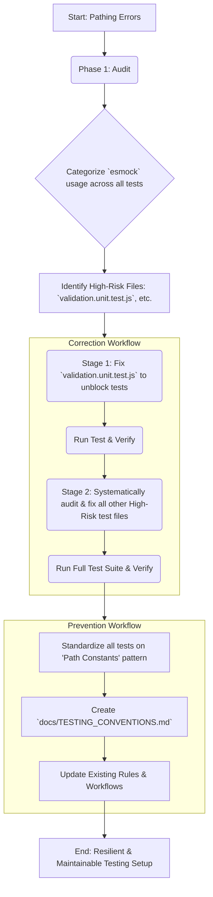

# Enhanced Plan: Systemic `esmock` Path Correction and Prevention

## 1. Introduction & Revised Goal

The goal of this plan is to **eradicate all `esmock` pathing errors across the entire test suite** and establish a clear, maintainable convention to prevent this class of error from recurring. This plan expands the scope from a single file to a project-wide audit, correction, and documentation effort.

## 2. Phase 1: Project-Wide `esmock` Audit

A project-wide search (`search_files`) was conducted to identify all test files using `esmock`. The results revealed several different usage patterns, some of which are brittle and prone to breaking when files are moved.

- **Pattern A (High-Risk):** Hardcoded, deep relative paths (e.g., `../../../src/...`). Found in `test/game/logic/validation.unit.test.js`, `test/game/phases/*.js`. These are the primary source of the current issue.
- **Pattern B (Medium-Risk):** Using `path.join(__dirname, ...)` as seen in `test/game/logic/aiLogic.unit.test.js`. This is slightly more robust but can still be confusing.
- **Pattern C (Best Practice):** Defining module paths as constants at the top of the file. Found in `test/socket/handlers/*.js`. This is the most maintainable pattern and will be adopted as the standard.

## 3. Phase 2: Staged Correction Strategy

The fix will be implemented in stages to ensure a controlled and verifiable process.

- **Stage 1: Unblock Current Work**

  - First, apply a precise `apply_diff` to fix the known errors in `test/game/logic/validation.unit.test.js`. This will resolve the immediate problem and allow the focused test to run.

- **Stage 2: Systemic Cleanup**
  - After the initial fix is verified, systematically read and correct all other test files identified in the audit that use high-risk pathing patterns.

## 4. Phase 3: Long-Term Prevention & Documentation

To ensure these issues do not happen again, the following documentation and standardization steps will be taken:

1.  **Standardize `esmock` Usage:** Refactor all tests that use `esmock` to adopt the **"path constants"** pattern (Pattern C). This makes paths easier to read, manage, and update in one central place within each test file.
2.  **Create New Conventions Document:** A new document will be created at `docs/TESTING_CONVENTIONS.md`. This file will codify the `esmock` pathing rules and serve as the official guide for all future tests.
3.  **Update Existing Rules & Workflows:** The new testing standard will be integrated into the existing project documentation to ensure it is visible and reinforced. The following files will be updated:
    - `C:\github\MuellerEuchre\.kilocode\workflows\debugging_precautions_layer_1_workflow.md`
    - `C:\github\MuellerEuchre\.kilocode\workflows\safe_debugging_analysis_workflow.md`
    - `C:\Users\mmuel\.kilocode\rules\In-Depth Development Plan Completing Layer 1 Core Logic Utilities Final, Enhanced.md`
    - `C:\github\MuellerEuchre\.kilocode\rules\Core Principles Development Rules for Layer 1.md`
4.  **Future-Proofing (Recommendation):** The new conventions document will also include a strong recommendation to implement **path aliases** (e.g., `@src/`, `@test/`) in the project's build or runtime configuration as a future enhancement. This is the industry-standard, most robust solution for eliminating relative path (`../..`) maintenance entirely.
